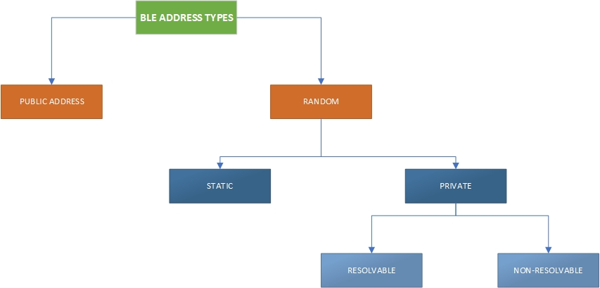
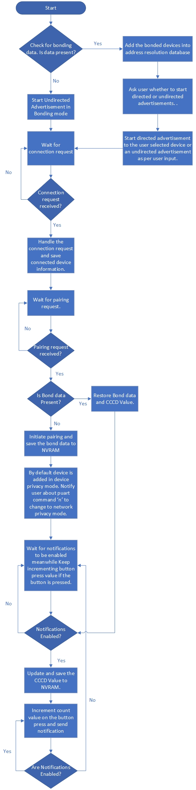

# BTSDK- Peripheral Privacy

This code example demonstrates the privacy features available to users in Bluetooth 5.0 and above using ModusToolbox™ software.

Features Demonstrated:
1. Privacy Modes as defined in Bluetooth Spec 5.0 and above.
2. Use of persistent storage for Bond Data management.
3. Management and handling of Bond data of multiple peer devices.

## Requirements
- [ModusToolbox® software](https://www.cypress.com/products/modustoolbox-software-environment) v2.2

   **Note:** This code example version requires ModusToolbox software version 2.2 or later and is not backward compatible with v2.1 or older versions. If you cannot move to ModusToolbox v2.2, use the latest compatible version of this example: [latest-v1.X](https://github.com/cypresssemiconductorco/mtb-example-btsdk-peripheral-privacy/tree/latest-v1.X).

- Board Support Package (BSP) minimum required version: 2.8.0

- Programming Language: C

- Associated Parts: [CYW20819](https://www.cypress.com/datasheet/CYW20819), [CYW20820](https://www.cypress.com/datasheet/CYW20820), [CYW20719](https://www.cypress.com/documentation/datasheets/cyw20719-enhanced-low-power-bredrble-bluetooth-50-soc), [CYW20735](https://www.cypress.com/documentation/datasheets/cyw20735b1-single-chip-bluetooth-transceiver-wireless-input-devices)

## Supported Toolchains (make variable 'TOOLCHAIN')

- GNU Arm® Embedded Compiler v9.3.1 (GCC_ARM) - Default value of `TOOLCHAIN

## Supported Kits (make variable 'TARGET')
- [CYW920819EVB-02 Evaluation Kit](http://www.cypress.com/CYW920819EVB-02)
- [CYW920820EVB-02 Evaluation Kit](http://www.cypress.com/CYW920820EVB-02)
- [CYW920719B2Q40EVB-01 Evaluation Kit](https://community.cypress.com/docs/DOC-17736)
- [CYW920735Q60EVB-01 Evaluation Kit](https://www.cypress.com/documentation/development-kitsboards/cyw920735q60evb-01-evaluation-kit)

## Hardware Setup
This example uses the board's default configuration. Refer to the kit user guide to ensure that the board is configured correctly.

## Software Setup
Install a terminal emulator if you don't have one. Instructions in this document use [Tera Term](https://ttssh2.osdn.jp/index.html.en). Install any BLE debug application from the respective app stores on iOS and Android to connect to the device. All other required software comes bundled with the ModusToolbox™.

## Using the Code Example

### In Eclipse IDE for ModusToolbox:

1. Click the **New Application** link in the **Quick Panel** (or, use **File** > **New** > **ModusToolbox Application**). This launches the [Project Creator](http://www.cypress.com/ModusToolboxProjectCreator) tool.

2. Pick a kit supported by the code example from the list shown in the **Project Creator - Choose Board Support Package (BSP)** dialog.

   When you select a supported kit, the example is reconfigured automatically to work with the kit. To work with a different supported kit later, use the [Library Manager](https://www.cypress.com/ModusToolboxLibraryManager) to choose the BSP for the supported kit and deselect the other BSPs. **Keep only the required BSP in your application** for more information refer [BTSDK Release Notes](https://community.cypress.com/community/software-forums/modustoolbox-bt-sdk). You can use the Library Manager to select or update the BSP and firmware libraries used in this application. To access the Library Manager, click the link from the Quick Panel.

   You can also just start the application creation process again and select a different kit.

   If you want to use the application for a kit not listed here, you may need to update the source files. If the kit does not have the required resources, the application may not work.

3. In the **Project Creator - Select Application** dialog, choose the example by enabling the checkbox.

4. Optionally, change the suggested **New Application Name**.

5. Enter the local path in the **Application(s) Root Path** field to indicate where the application needs to be created.

   Applications that can share libraries can be placed in the same root path.

6. Click **Create** to complete the application creation process.
For more details, see the [Eclipse IDE for ModusToolbox User Guide](https://www.cypress.com/MTBEclipseIDEUserGuide) (locally available at *{ModusToolbox install directory}/ide_{version}/docs/mt_ide_user_guide.pdf*).

For more details, see the [Eclipse IDE for ModusToolbox User Guide](https://www.cypress.com/MTBEclipseIDEUserGuide) (locally available at *{ModusToolbox install directory}/ide_{version}/docs/mt_ide_user_guide.pdf*).
### In Command-line Interface (CLI):

ModusToolbox provides the Project Creator as both a GUI tool and a command line tool to easily create one or more ModusToolbox applications. See the "Project Creator Tools" section of the [ModusToolbox User Guide](https://www.cypress.com/ModusToolboxUserGuide) for more details.

Alternatively, you can manually create the application using the following steps.

1. Download and unzip this repository onto your local machine, or clone the repository.

2. Open a CLI terminal and navigate to the application folder.

   On Linux and macOS, you can use any terminal application. On Windows, open the **modus-shell** app from the Start menu.

   **Note:** The cloned application contains a default BSP file (*TARGET_xxx.mtb*) in the *deps* folder. Use the [Library Manager](https://www.cypress.com/ModusToolboxLibraryManager) (`make modlibs` command) to select and download a different BSP file, if required and deselect the other BSPs. **Keep only the required BSP in your application** for more information refer [BTSDK Release Notes](https://community.cypress.com/community/software-forums/modustoolbox-bt-sdk). If the selected kit does not have the required resources or is not [supported](#supported-kits-make-variable-target), the application may not work.

3. Import the required libraries by executing the `make getlibs` command.

Various CLI tools include a `-h` option that prints help information to the terminal screen about that tool. For more details, see the [ModusToolbox User Guide](https://www.cypress.com/ModusToolboxUserGuide) (locally available at *{ModusToolbox install directory}/docs_{version}/mtb_user_guide.pdf*).

### In Third-party IDEs:

1. Follow the instructions from the [CLI](#in-command-line-interface-cli) section to create the application, and import the libraries using the `make getlibs` command.

2. Export the application to a supported IDE using the `make <ide>` command.

    For a list of supported IDEs and more details, see the "Exporting to IDEs" section of the [ModusToolbox User Guide](https://www.cypress.com/ModusToolboxUserGuide) (locally available at *{ModusToolbox install directory}/docs_{version}/mtb_user_guide.pdf*.

3. Follow the instructions displayed in the terminal to create or import the application as an IDE project.

## Operation

1. Connect the board to your PC using the provided USB cable through the USB connector.

2. Open a terminal program and select the COM port (generally, it is the higher numbered port). Set the serial port parameters to 8N1 and 115200 baud.

3. Program the board.

4. The application runs a custom button service with one custom characteristic that counts the number of button presses on the kit. It can be read or setup for notifications. Each time the button on the kit is pressed the count value is incremented. If any device is connected and has notifications enabled the updated value is sent to it. If no device is connected or notifications are disabled a message informing the same is displayed.

>NOTE: The button count is incremented on the button press irrespective of whether any device is connected or not.
5. Following instructions appear on the terminal on application start :
    * Press **'l'** to check for the number of bonded devices and next empty slot
        - This Option allows you to see how many devices are paired to the peripheral and which is the next available slot. This example supports upto 4 bonded devices after which the oldest devices data is overwritten.
    * Press **'r'** to erase all the bond data present in NVRAM
        - This option allows user to clear the memory of all the present bond data.
    * Press **'e'** to enter the bonding mode and add devices to bond list
        - This option puts the peripheral into bonding mode allowing it to connect and bond with new devices. After connection and bonding the incoming device can read and subscribe to the custom button count service.
    * Press **'p'** to change privacy mode of bonded device
        - This is used to change the privacy mode setting of the bonded devices i.e to move devices from device privacy mode to netwok privacy mode and vice versa. For more information about the privacy modes read the design and implementation section.
    * Press **'h'** any time in application to print the menu
        - At any point in the program to look at the options available user can request the start menu options.

        Use these available commands to interact with the application. Refer [Figure 2](#Figure-2-Process-Flowchart) for the application flow chart.

## Design and Implementation

### Introduction
The Objective of the application is to demonstrate how the user can make use of privacy features available in the Bluetooth Devices. Bluetooth devices implement privacy mainly by using **different types of addresses**: Public, which means no privacy, or Random. Random addresses can be Static (which don't change) or Private (which change periodically, offering privacy protection). Private addresses can be further divided into Non-resolvable or Resolvable.

The use of resolvable private addresses allows only the devices that are paired to your device to "identify" the device as a known device; all other devices will perceive the device as a new device, making it difficult to track. If the device uses non-resolvable private address, it will be perceived as a new device every time it changes its address. The address is changed at regular intervals and is configurable.

Every Privacy-enabled BLE device has a unique address called the Identity Address and an Identity Resolving Key (IRK). The Identity Address is the Public Address or Static Address of the BLE device. The IRK is used by the BLE device to generate its RPA and is used by peer devices to resolve the RPA of the BLE device. Both the Identity Address and the IRK are exchanged during the pairing process. Privacy-enabled BLE devices maintain a list that consists of the peer device’s Identity Address, the local IRK used by the BLE device to generate its RPA, and the peer device’s IRK used to resolve the peer device’s RPA. This is called the Resolving List. Only peer devices that have the 128-bit identity resolving key (IRK) of a BLE device can determine the device's address.

Max Resolving list size supported on different devices is:
- CYW20819    : 20 entries
- CYW20820    : 20 entries
- CYW20735B1  : 128 entries
- CYW20719B2  : 128 entries

##### Figure 1. BLE Address Types

Apart from this, Bluetooth 5.0 introduced more options in the form of **privacy modes**.

There are two modes of privacy: **device privacy** mode and **network privacy** mode.

A device in *device privacy* mode is only concerned about the privacy of the device and will accept advertising/connection packets from peer devices that contain their identity address as well as ones that contain a private address, even if the peer device has distributed its Identity Resolution Key (IRK) in the past.

In *network privacy* mode, a device will only accept advertising/connection packets from peer devices that contain private addresses. By default, network privacy mode is used when private addresses are resolved and generated by the Controller.

[Table 1](#table-1-logical-representation-of-resolving-list-entries) shows the logical representation of the resolving list when a device that is trying to reconnect the controller checks the resolving list for the device. Depending on the result two things can happen as follows:

1. Device is found in the list.

|Advertisement/Connection Address Type| Privacy Mode  |Request Accepted/Rejected|
| ------------------------------------|---------------|-------------------------|
| Identity Address                    | Network       | Rejected                |
| Identity Address                    | Device        | Accepted                |
| Resolvable Private Address          | Network       | Accepted                |
| Resolvable Private Address          | Device        | Accepted                |

2. Device not found in the list.

    In this case, the incoming device is treated as a new device and the request is forwarded to the host by the controller for further processing.

**Note**: A device using non-resolvable private address will be treated as a new device on every reconnection.

##### Table 1. Logical Representation of Resolving List Entries

| Device|Local IRK | Peer IRK  | Peer Identity Address  |Identity Address Type  | Privacy Mode    |
| ------|----------|-----------|------------------------|--------------|-----------------|
| 1     |Local IRK | Peer 1 IRK| Peer 1 Identity Address|Static/Public| Network/Device|
| 2     |Local IRK | Peer 2 IRK| Peer 2 Identity Address|Static/Public| Network/Device|
| 3     |Local IRK | Peer 3 IRK| Peer 3 Identity Address|Static/Public| Network/Device|

The application runs a custom button service with one custom characteristic that counts the number of button presses on the kit. It can be read or setup for notifications.The GATT DB is setup so that the characteristic can be read without pairing/bonding but for enabling and disabling notifications pairing/bonding is required. Each time the button on the kit is pressed the count value is incremented. If any device is connected and has notifications enabled the updated value is sent to it. If no device is connected or notifications are disabled a message informing the same is displayed.

The device can store bond data of upto 4 peer devices after which the data of the oldest device is overwritten by that of the new incoming device. The incoming device is added in device privacy mode by default which can be changed by issuing **'p'** command via terminal.

The peripheral has 5 states:

1. **IDLE_NO_DATA** : The device in this state is either waiting for the user input or advertising. No bond Data is present in the NVRAM. Directed advertising option is disabled in this state.
2. **IDLE_DATA** : The device in this state is either waiting for the user input or advertising. Bond Data is present in the NVRAM. Directed advertising option is available.
3. **IDLE_PRIVACY_CHANGE**: The device in this state is not advertising. The device enters this mode when command to change the privacy mode of bonded devices is issued.
4. **CONNECTED**: In this state the peripheral is connected to a peer device.
5. **BONDED**: The peripheral moves into this state once it has has paired and bonded with the connected device and the peer bond information has been saved to NVRAM.

The LED 1 on the kit is used to represent the current advertising state of the device. [Table 2](#table-2-led-behaviour-for-advertising-states) shows LED behaviour for different advertising states.

##### Table 2. LED behaviour for advertising states
|Advertisement State           | LED state                       |
|------------------------------|---------------------------------|
|Advertisement ON (Undirected) | Slow Blinking led (T = 1 sec)   |
|Advertisement ON (Directed):  | Fast Blinking led (T = 200 msec)|
|Advertisement OFF, Connected: | LED ON                          |
|Advertisement OFF, Timed out: | LED OFF                         |

##### Figure 2. Process Flowchart

## Resources and Settings
This section explains the ModusToolbox resources and their configuration as used in this code example. Note that all the configuration explained in this section has already been done in the code example.

The ModusToolbox stores the device configuration settings of the application in the *design.modus* file. This file is used by the device configurators, which generate the configuration firmware. It is present in the respective kit BSP folder in *wiced_btsdk* project. For example for CYW920819EVB-02 the path is *<workspace_path>/mtb_shared/wiced_btsdk/dev-kit/bsp/TARGET_CYW920819EVB-02/COMPONENT_bsp_design_modus/design.modus*.

Similarly bluetooth configuration settings are stored in *cycfg_bt.cybt*. It is a xml file which contains configuration such as Device name and information about GATT database. It is present in the application folder.

* **Device Configurator** The Device Configurator is used to enable/configure the peripherals and the pins used in the application. See the
[Device Configurator Guide](https://www.cypress.com/ModusToolboxDeviceConfig).

* **Bluetooth Configurator:** The Bluetooth Configurator is used for generating/modifying the BLE GATT database. See the
[Bluetooth Configurator Guide](https://www.cypress.com/ModusToolboxBLEConfig).

## Related Resources

| **Application Notes**                                            |                                                              |
| :----------------------------------------------------------- | :----------------------------------------------------------- |
|[AN225684 – Getting Started with CYW208XX](http://www.cypress.com/an225684) | Describes CYW20819, CYW20820 Bluetooth SoC, software/hardware development ecosystem, and how to build your first BLE application using the device in ModusToolbox.
|**Code Examples**| Visit the [Cypress GitHub repo](https://www.cypress.com/mtb-github) for a comprehensive collection of ModusToolbox code examples|
|**Device Documentation**|
|[CYW20819 Device Datasheet](https://www.cypress.com/datasheet/CYW20819)|
|[CYW20820 Device Datasheet](https://www.cypress.com/datasheet/CYW20820)|
|[CYW20719 Device Datasheet](https://www.cypress.com/documentation/datasheets/cyw20719-enhanced-low-power-bredrble-bluetooth-50-soc)|
|[CYW20735 Device Datasheet](https://www.cypress.com/documentation/datasheets/cyw20735b1-single-chip-bluetooth-transceiver-wireless-input-devices)|
|**Development Kits** |
|[CYW920819EVB-02 Evaluation Kit](http://www.cypress.com/CYW920819EVB-02)|
|[CYW920820EVB-02 Evaluation Kit](http://www.cypress.com/CYW920820EVB-02)|
|[CYW920719B2Q40EVB-01 Evaluation kit](https://community.cypress.com/docs/DOC-17736)|
|[CYW920735Q60EVB-01 Evaluation Kit](https://www.cypress.com/documentation/development-kitsboards/cyw920735q60evb-01-evaluation-kit)|
|**Tool Documentation** |
|[ModusToolbox](http://www.cypress.com/modustoolbox)| The Cypress development system for IoT designers|
--------------------------------------------------------------------------------------------

## Document History

Document Title: *CE228751 - Peripheral Privacy*

| Version | Description of Change                        |
| ------- | ---------------------------------------------|
| 1.0.0   | New code example                             |
| 1.1.0   | Updated to support ModusToolbox software v2.1|
| 2.0.0   | Major update to support ModusToolbox software v2.2, added support for new kits  This version is not backward compatible with ModusToolbox software v2.1  |

----------------------------------------------------------

-------------------------------------------------------------------------------

© Cypress Semiconductor Corporation, 2020. This document is the property of Cypress Semiconductor Corporation and its subsidiaries (“Cypress”).  This document, including any software or firmware included or referenced in this document (“Software”), is owned by Cypress under the intellectual property laws and treaties of the United States and other countries worldwide.  Cypress reserves all rights under such laws and treaties and does not, except as specifically stated in this paragraph, grant any license under its patents, copyrights, trademarks, or other intellectual property rights.  If the Software is not accompanied by a license agreement and you do not otherwise have a written agreement with Cypress governing the use of the Software, then Cypress hereby grants you a personal, non-exclusive, nontransferable license (without the right to sublicense) (1) under its copyright rights in the Software (a) for Software provided in source code form, to modify and reproduce the Software solely for use with Cypress hardware products, only internally within your organization, and (b) to distribute the Software in binary code form externally to end users (either directly or indirectly through resellers and distributors), solely for use on Cypress hardware product units, and (2) under those claims of Cypress’s patents that are infringed by the Software (as provided by Cypress, unmodified) to make, use, distribute, and import the Software solely for use with Cypress hardware products.  Any other use, reproduction, modification, translation, or compilation of the Software is prohibited.
TO THE EXTENT PERMITTED BY APPLICABLE LAW, CYPRESS MAKES NO WARRANTY OF ANY KIND, EXPRESS OR IMPLIED, WITH REGARD TO THIS DOCUMENT OR ANY SOFTWARE OR ACCOMPANYING HARDWARE, INCLUDING, BUT NOT LIMITED TO, THE IMPLIED WARRANTIES OF MERCHANTABILITY AND FITNESS FOR A PARTICULAR PURPOSE.  No computing device can be absolutely secure.  Therefore, despite security measures implemented in Cypress hardware or software products, Cypress shall have no liability arising out of any security breach, such as unauthorized access to or use of a Cypress product.  CYPRESS DOES NOT REPRESENT, WARRANT, OR GUARANTEE THAT CYPRESS PRODUCTS, OR SYSTEMS CREATED USING CYPRESS PRODUCTS, WILL BE FREE FROM CORRUPTION, ATTACK, VIRUSES, INTERFERENCE, HACKING, DATA LOSS OR THEFT, OR OTHER SECURITY INTRUSION (collectively, “Security Breach”).  Cypress disclaims any liability relating to any Security Breach, and you shall and hereby do release Cypress from any claim, damage, or other liability arising from any Security Breach.  In addition, the products described in these materials may contain design defects or errors known as errata which may cause the product to deviate from published specifications.  To the extent permitted by applicable law, Cypress reserves the right to make changes to this document without further notice. Cypress does not assume any liability arising out of the application or use of any product or circuit described in this document.  Any information provided in this document, including any sample design information or programming code, is provided only for reference purposes.  It is the responsibility of the user of this document to properly design, program, and test the functionality and safety of any application made of this information and any resulting product.  “High-Risk Device” means any device or system whose failure could cause personal injury, death, or property damage.  Examples of High-Risk Devices are weapons, nuclear installations, surgical implants, and other medical devices.  “Critical Component” means any component of a High-Risk Device whose failure to perform can be reasonably expected to cause, directly or indirectly, the failure of the High-Risk Device, or to affect its safety or effectiveness.  Cypress is not liable, in whole or in part, and you shall and hereby do release Cypress from any claim, damage, or other liability arising from any use of a Cypress product as a Critical Component in a High-Risk Device.  You shall indemnify and hold Cypress, its directors, officers, employees, agents, affiliates, distributors, and assigns harmless from and against all claims, costs, damages, and expenses, arising out of any claim, including claims for product liability, personal injury or death, or property damage arising from any use of a Cypress product as a Critical Component in a High-Risk Device.  Cypress products are not intended or authorized for use as a Critical Component in any High-Risk Device except to the limited extent that (i) Cypress’s published data sheet for the product explicitly states Cypress has qualified the product for use in a specific High-Risk Device, or (ii) Cypress has given you advance written authorization to use the product as a Critical Component in the specific High-Risk Device and you have signed a separate indemnification agreement.
Cypress, the Cypress logo, Spansion, the Spansion logo, and combinations thereof, WICED, PSoC, CapSense, EZ-USB, F-RAM, and Traveo are trademarks or registered trademarks of Cypress in the United States and other countries.  For a more complete list of Cypress trademarks, visit cypress.com.  Other names and brands may be claimed as property of their respective owners.
